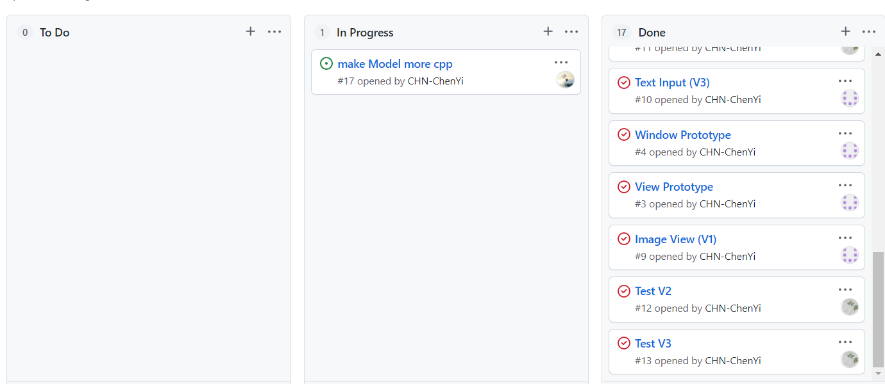
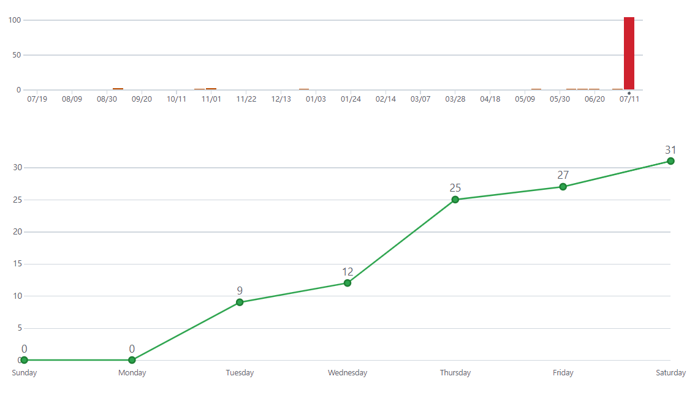
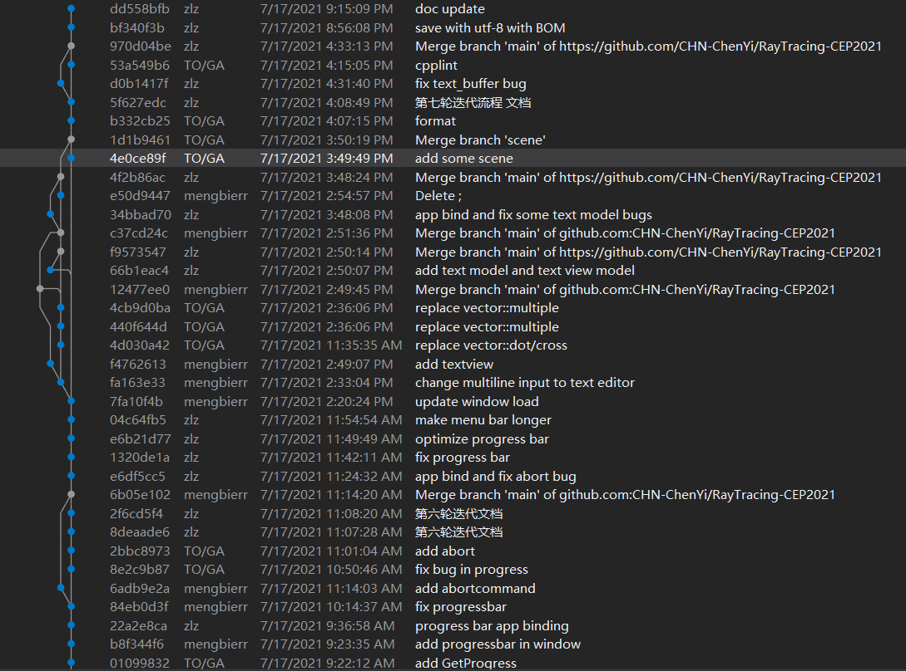
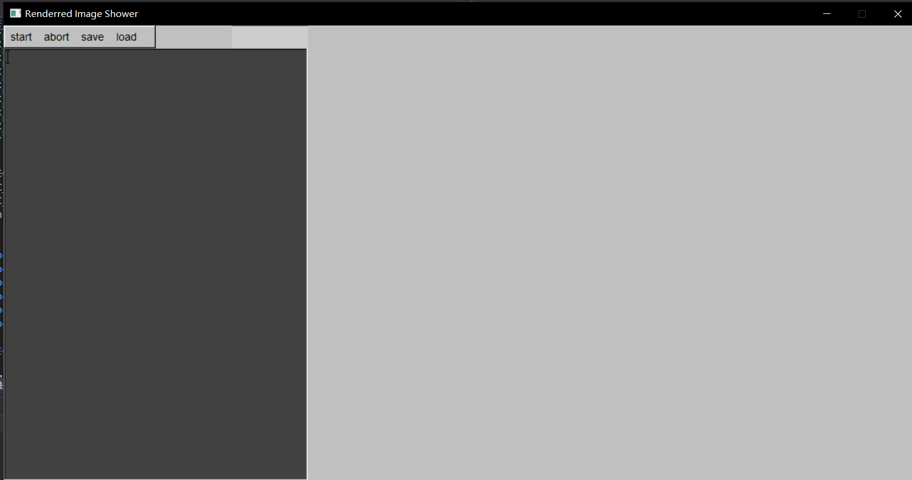
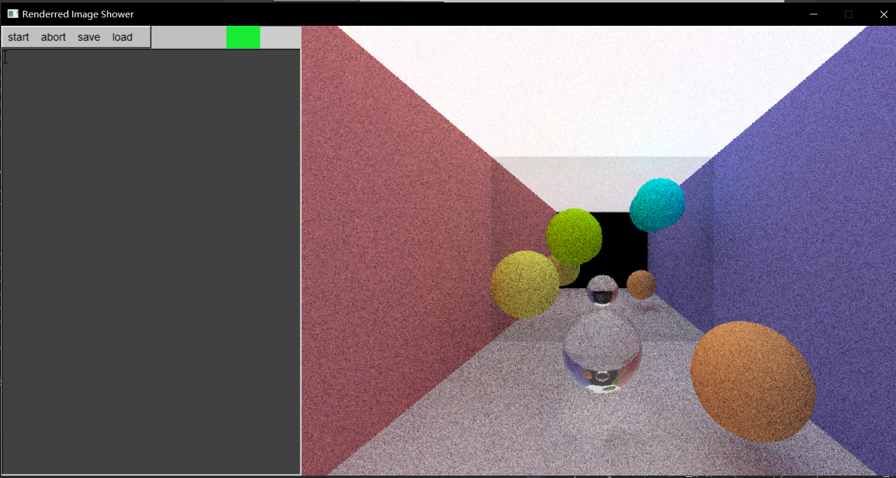
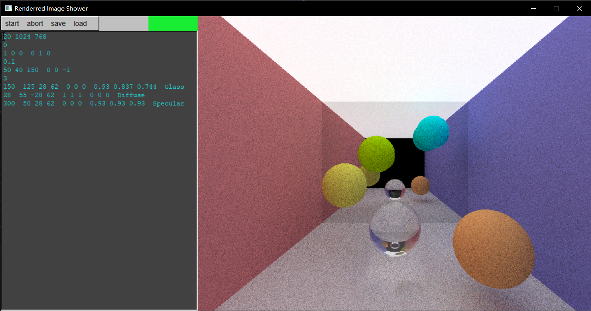
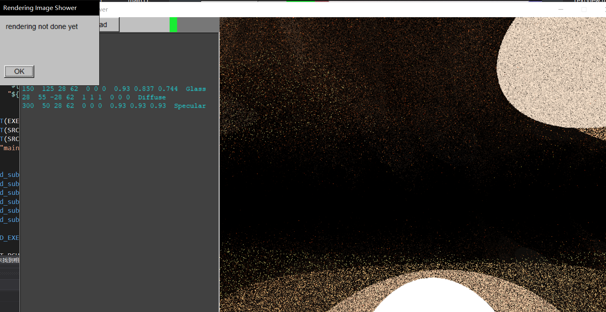
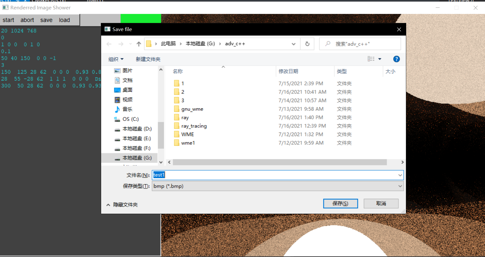

# 中期报告

光线组（原计算中心组）

## 迭代情况说明  

目前已进行了7轮迭代

### 第一轮迭代

目标：显示一张图片，搭建 mvvm 框架

app（及其组成部分）初始化

+ model 初始化

+ view model 初始化

+ main window 初始化

+ main window 增加图片控件

+ main window 注册 close 回调

+ view model 获取 model 引用

+ 为 model 增加 notification (是 view model 的通知函数 (通知渲染一次完成))

+ 为 图片显示控件 获取 图片名引用 （从 view model 中获取 )

+ 为 main window 获取 开始渲染命令

+ 为 main window 获取 关闭命令 (从 app层 获取) 

+ 为 view model 增加 notification （main window (通知一次渲染完成) ）

  > 内容为图片控件.show()

app 运行

+ 运行 main window.StartRenderingCommand()

  > (因为是主动运行,不需要回调)

### 第二轮迭代

目标：实时渲染，并显示图片；使窗口在渲染过程中不能关闭

分工：
app: 朱理真
view, window:余倚岑
view model, model:陈易

在第一次的基础上，修改：

+ 增加渲染，使用渲染图片

+ 删除 Property : ImageName

  > 删除 ImageShower 中 attach_ImageName 和 detach
  > 删除 ViewModel 中 的ImageName接口
  > app 中也相应地删除绑定

+ 增加 Property : ImagePtr (结构Image的指针)

  > 增加 ImageShowr 对 ImagePtr 引用指针的attach 和 detach函数
  >
  > 增加 ViewModel 中 的ImagePtr接口
  > app 中也相应地增加绑定

+ 修改 图片显示方式

  > 修改 ImageShower.show()
  >
  > > 使用Fl_RGB_Image替代Fl_Shared_Image

+ 增加 Property: task_future (属性值 CSL::RefPtr<std::future<void>>）

  > 在window中增加对这一属性的引用，并增加attach 和 detach 函数

+ 增加 ViewModel中的接口

  > app也相应地增加绑定

+ 修改window::close_cb 回调函数,具体为

  > 若 task_future.wait_for(std::chrono::milliseconds(1)) == std::future_status::ready 
  > 弹出报错窗口，不调用default_callback函数

+ 对窗口进行美化

### 第三轮迭代

目标：增加文本输入框，并通过输入文本自定义渲染参数

+ window 增加文本输入框

+ Model 增加输入处理

+ window 获取属性：报错信息

### 第四轮迭代

目标：增加保存图片功能

+ ViewModel增加保存图片命令,Model增加保存图片功能

+ window增加相应的attach和detach SaveCommand命令

+ app 绑定save命令

+ window新增菜单，回调为save_cb,打开fltk自带的文件选择器，获取保存地址字串后调用m_cmdSave成员进行保存

难点：

+ 文件地址字符串必须要支持中文，因此只使用传统的string对象是不够的

### 第五轮迭代

目标：在图片渲染过程中增加进度条

+ view 增加 ProgressBar类

+ viewmodel 和 model 增加进度条值属性（0-100的整数）

- view 增加 上述属性的 attach 和 detach 功能
- 在 window的getNotification中，增加ProgressBar成员的show()函数
- app 进行绑定

### 第六轮迭代

目标：增加abort按钮，可以终止渲染

- view model增加 getAbortCommand

- window 增加对应的command成员，并实现attach和detach

- window 增加一栏菜单"abort",其回调函数调用m_cmdAbort

- app bind

### 第七轮迭代

目标：增加load按钮，可以选择文本文件载入文本框

- 增加TextModel 和 ViewModel,用于load文本文件，以及存储文本的buffer

- 增加View 层 TextEditor,其需引用TextViewModel返回的buffer，因此增加attach和detach属性

- 需将ViewModel的getLoadCommand 赋给window的 m_cmdLoad ,因此增加相应的attach和detach函数

- window增加load按钮，其回调函数调用m_cmdLoad

- app 进行绑定

## 技术问题与难点

第一轮迭代 

> 图片显示后被删除,
> 由于以后迭代不再显示已有图片，故问题解决

第二轮迭代 

> 通过指定文件名，使用Fl_shared_image对象显示图片，但发现图片内容更改后无法更新，
> 故改成Fl_rgb_image,以图像数据为基础显示图片
>
> Renderer中线程执行时出错，修复
>
> 存在线程未结束就关闭程序的隐患，
> 故增加future属性，并在不应关闭时弹出提示

第三轮迭代 

> 未执行渲染时就关闭窗口出错，原因
> Image析构出错，因为delete[]了空指针

第四轮迭代 

> 保存图片后报错，是由于
> 中文问题，进行string和wstring的转换

第五轮迭代

> 进度条颜色显示不正确，因为没有按照rgb的格式来，因此除了长宽，还要有一个通道层数的维度

第七轮迭代

> 问题：关闭程序窗口后报错，提示关于Fl_text_buffer的回调函数错误
> 解决：经老师提醒，发现是析构顺序的问题，由于窗口和模型之间有依赖关系，所以应当先析构窗口，再析构模型。难点是把握各个变量的生命周期  

## 协作情况  

分工依然是朱理真负责app部分，于倚岑负责window和view部分，陈易负责model和view model部分，

三人针对某一轮迭代问题并行协作，通常是陈易给出get属性名()函数或get命令()函数，余倚岑实现属性或命令的attach和detach, 朱理真则负责将两者绑定。

（为什么没有notification? 因为该图片渲染程序一般只需每渲染完成一张图片时通知，不需要额外的notification)

上述过程使用git进行版本控制，同时与github上的远程仓库同步，实现持续存储。由于每个人负责不同的部分，基本可以直接推送到主分支。

下面是一些协作过程的展示：

+ 使用卡片管理问题

  

+ commit 状况

  

+ 一些commit截图

  

## 部分效果图  

+ 打开程序

  

+ 渲染过程中

  

+ 编辑文本参数

  

+ 弹出错误提示（未渲染完成时关闭）

  

+ 保存图片(加载文本也是类似的)

  

## 总体心得

​	从7月12日到今天已经过了5天，我们已经进行了7轮迭代（每一轮迭代基本只增加一种功能），深感合作效率之高，这既是因为3个人每天都聚在机房里，交流效率高，同时更重要的，mvvm框架也使得项目各个模块之间减少了耦合，从而每个人独立且并行地实现自己的功能。当然，也有工具的使用带来的好处，使用GitHub，不需要手动合并，每个人直接push即可（也许先pull），而且就算不小心对代码进行了错误修改，也可以从commit记录中“捞”回来，不需要进行额外的备份，极大地提高了工作效率。cpplint等其他工具的使用，也使得我们免去额外的一些工作，专注于coding. 总之，在先进的框架和环境下合作，是我们收获颇丰。当然，也不是搭建了mvvm框架就一劳永逸了，之后的新功能如何加入，其各部分又隶属于哪一个层次，这些都是我们在维护框架的过程中，所需要审慎考虑的。

## 个人心得

+ 朱理真

  我负责app层的代码，是产品经理和测试员的角色。相比其他模块，app层的代码量较少，因此我还负责文档的编写和最后的测试整合。在大家敲定本轮迭代的目标和方案后，我会马上完成一个迭代流程文档的编写，以确认大家的思路是否统一，同时起一个指向的作用。不局限于app层，我经常要把目光放在程序整体上，关注框架里绑定的流程，需要清楚各个层次的功能。担任这样的角色，使我对mvvm的理解较为清晰，同时锻炼了我整体规划的能力。除了框架以外，工具的使用对于我的影响也是巨大的，之前几乎没有用过CMake, GitHub和git等工具，因此对这些工具的初步掌握，极大地改变了我的工作模式，提升了工作效率，即使以后，也对我影响深刻。同时，组员也是非常靠谱的，我认为和他们一起工作，氛围非常愉快，交流也十分有效，因此感谢他们的项目的贡献。也非常感谢袁老师，老师的指导是非常给力的，每次都使我忽然醒悟，知道了问题如何解决。

+ 于倚岑

+ 陈易

