# 项目成果和总结

光线组

## 项目成果

- 程序界面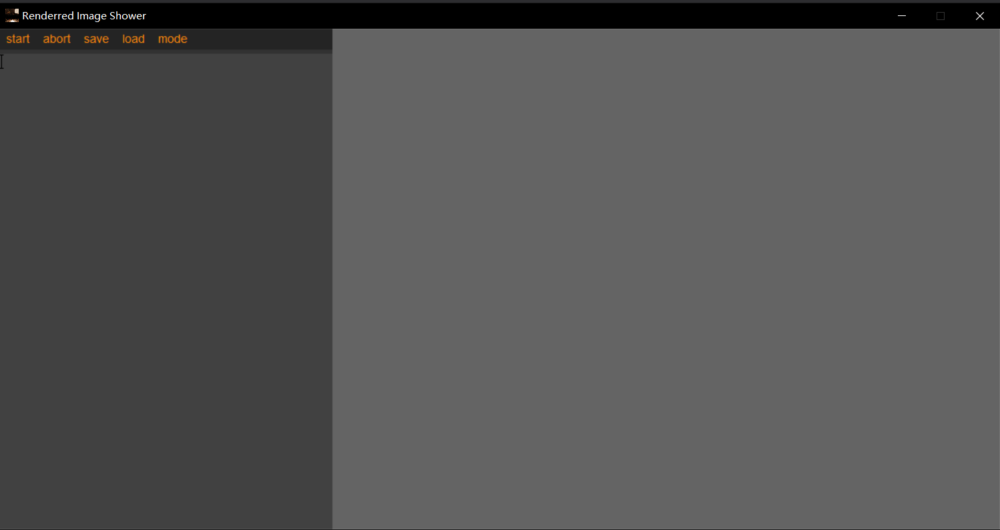
- 渲染运行过程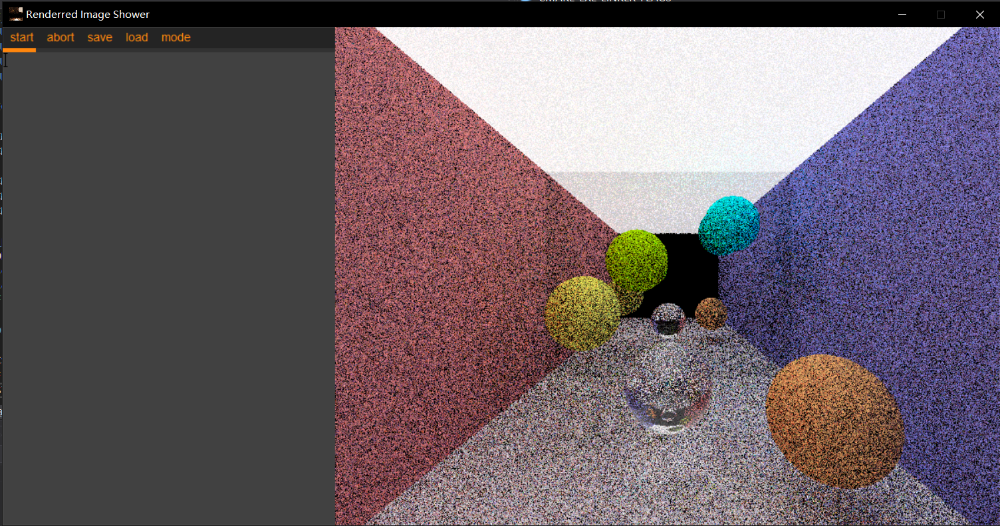
- 自定义配置参数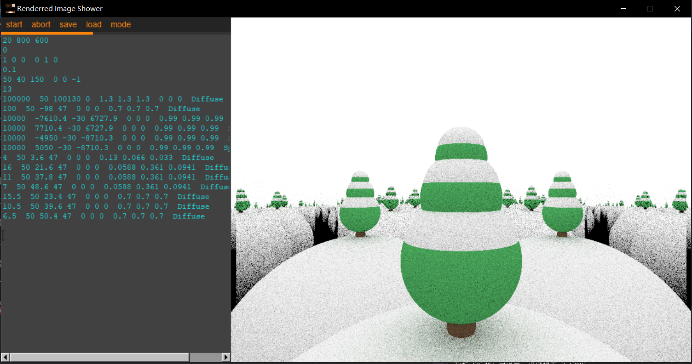
- 自定义配置参数（2）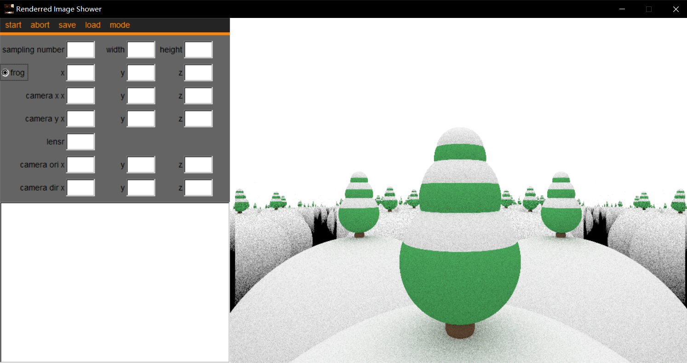
- 参数文件加载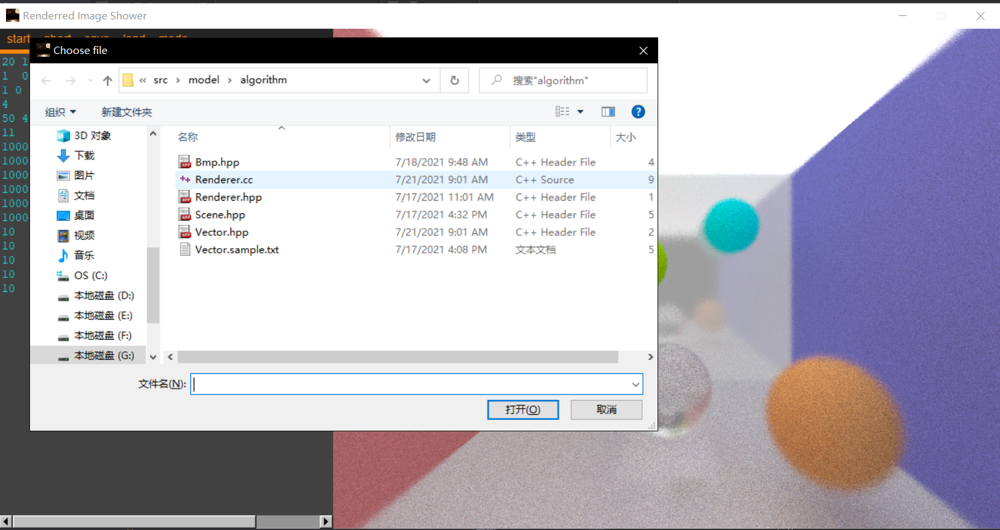
- 渲染图片保存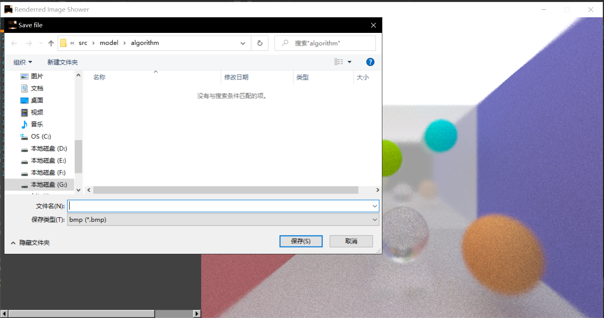
- 参数设置错误提示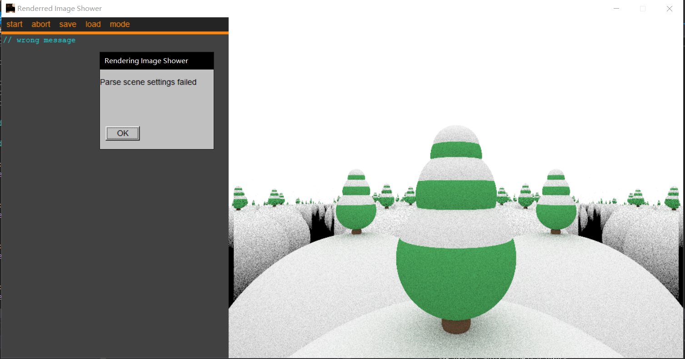
- 渲染未完成时退出错误提示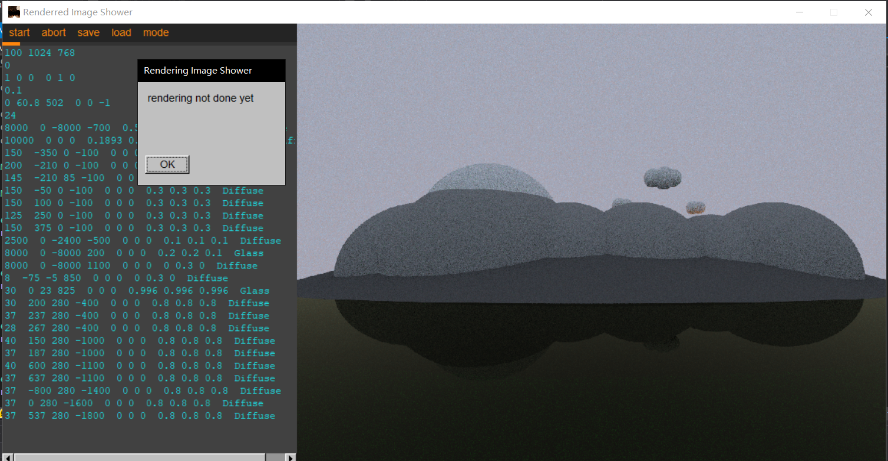
- 终止渲染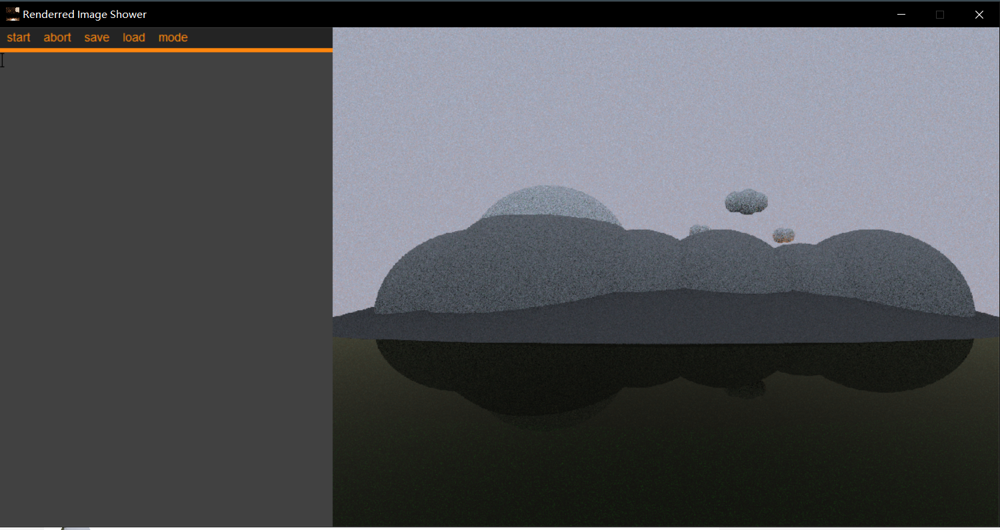

## 工具使用情况

### 协作

- 使用Git与GitHub进行协作

  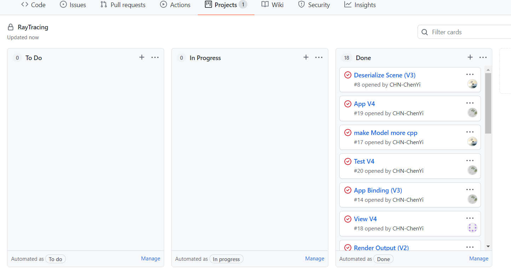

  ​                                                                        问题管理

  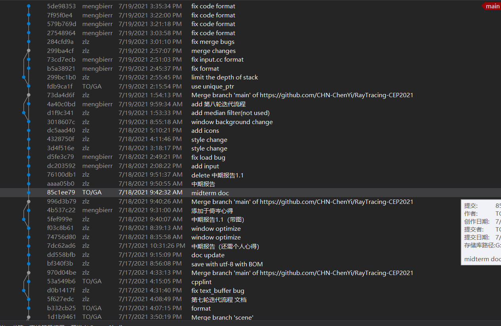

  ​                                                                 提交历史记录

  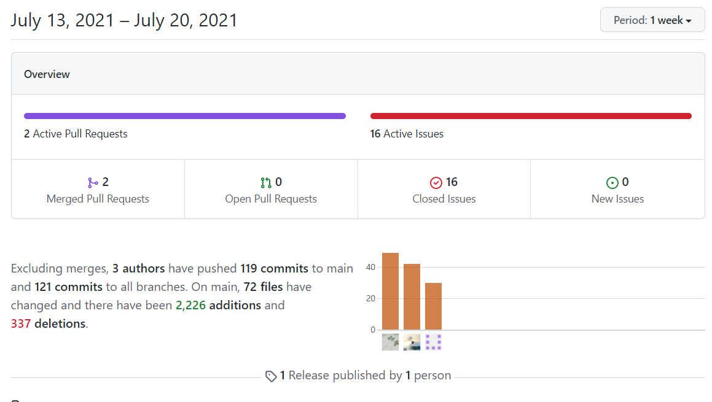

  ​                                                                      提交贡献

  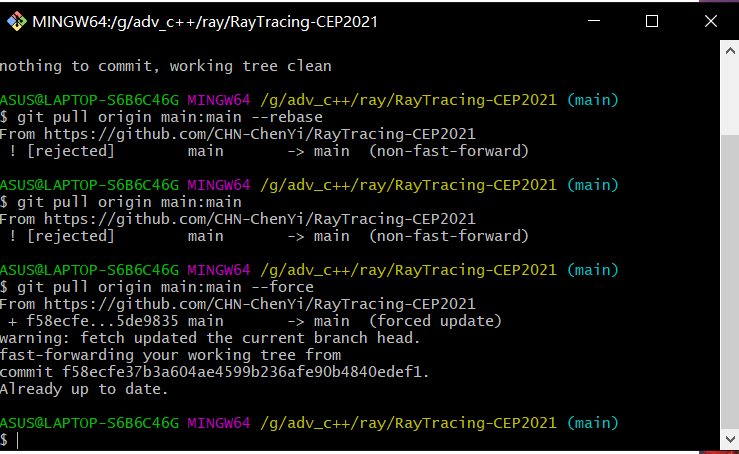

  ​                                                                     Git使用

### 开发

- CMake 实现跨平台编程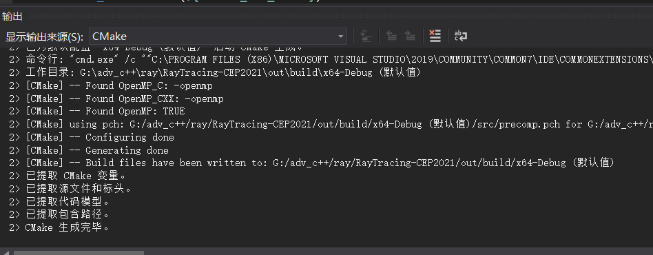

### 集成

- 代码提交时，自动使用cpplint，进行代码格式整理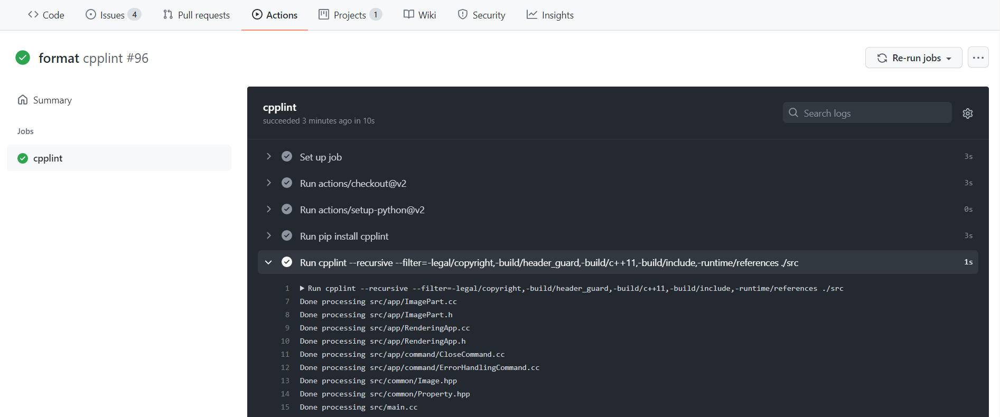

- tag变更时，msbuild自动进行重新编译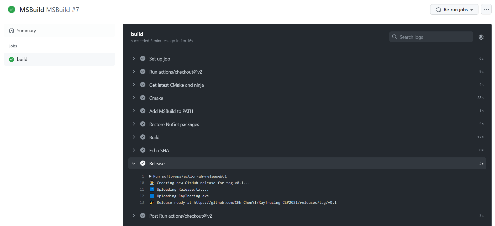

  并发布release版本

  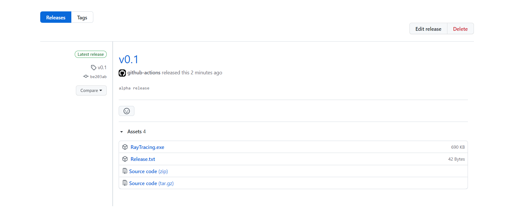

## 课程总结

​		C++项目管理与工程实践这门课，终于到了尾声。我们从开始的茫然无措，到弄懂范例工程，开始构建项目，一轮轮迭代，终于到了现在，课程设计圆满完成。从这门课中，我们学习并实践了C++最先进的语法和编程结构（相比经典的C++11和C++98），以及为交互界面和逻辑结构设计的mvvm结构（相比mvc结构），在之前的《面向对象程序设计》基础上，进行了新的一轮“迭代”。在以后的技术合作中，我们也一定以此为基础，追求更好更方面的编程思想与理念。

## 个人心得

- 朱理真

  正如我在中期报告个人心得中所表达的，我在此次短学期课程中收获了很多，但我仍然也有许多不足。由于我们程序结构的特殊性，mvvm结构的notification基本只用到了一种（通知渲染完成），其他的功能基本上只要获取属性的所有权，就能实现从model->viewmodel->view的反馈。因此我认为，我们并没有充分实践这一结构（也许要做一个小游戏，或者更复杂的控制），以体现其优越性。在以后的应用中，我还会继续尝试使用mvvm这一设计结构，体会其便利所在。

- 于倚岑

  在本次项目中，我主要负责view层和window层的实现，从第一轮实现框架到最后实现了完整的功能，让我对MVVM框架的理解更加深入。在实际工作时，我不需要知道后端实现的任何内容，只需要提供attach和detach接口以及接收notification，连接操作由App层来实现，这样可以让每个人的工作互不干扰，提升工作效率，又方便功能修改，缩短迭代周期。另外，我们还使用了git, cmake, cpplint等工具，为我们的开发过程提供了便利。本次项目是一次宝贵的经验，让我学会了C++编程时的规范和需要注意的陷阱，为以后做开发工作奠定了基础。

- 陈易

  本次项目中，我负责的是 Model 及其算法层以及 View Model 层的实现，在项目的一步步推进中逐渐了解掌握了 MVVM 模式解耦的优势。当然，在项目过程中，我也学习了一些新的 C++ 语言特性诸如智能指针，std::async 等的使用。同时也改掉了一些坏的习惯，比如以前写 Vector 类的时候会把 * / % 分别重载为不同意义的乘法，但是我现在意识到这样滥用运算符重载会导致语义不明，于是不再使用这种方法了。在项目中我们还使用了 Git, CMake, cpplint, GitHub Actions 等工具，其中使用 GitHub Actions 进行编译发布是我第一次这样尝试，在经过几轮调试之后成功使它在有 git tag 的时候自动触发，方便了持续部署的流程。这次项目给我提供了宝贵的 C++ 桌面程序开发经验，为以后的开发工作做了准备。

## 课程建议

​	建议往后平移上课时间（获取可以挪到晚上）

​	

